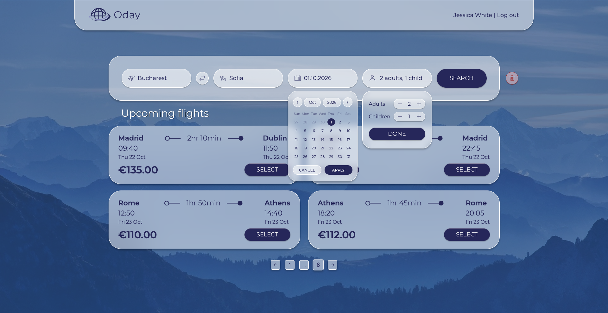
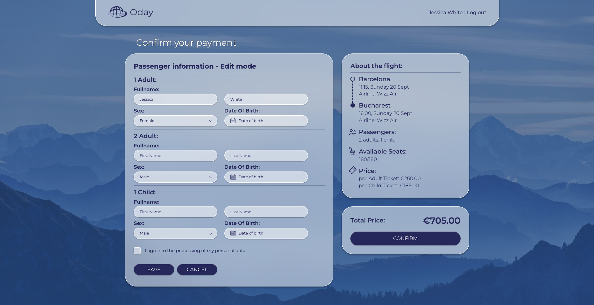

# Oday - Flight Booking App ✈️

Oday is a full-stack flight booking application: search flights, book seats for multiple passengers, pay by card via Stripe, and download your e-ticket as a PDF.

---



---

## Features

- Flight search by origin, destination and date, with pagination
- Email/password authentication (JWT in an httpOnly cookie)
- Passenger booking form with validation
- Card payment via Stripe (PaymentIntent flow, custom UI built with Stripe Elements)
- Personal cabinet with a paginated list of purchased tickets
- PDF ticket download, generated client-side
- Seat availability tracked per flight

---



---

## Tech stack

**Frontend:** React 19, TypeScript, Vite, React Router, React Hook Form + Zod, Zustand, SCSS Modules, Stripe Elements, @react-pdf/renderer

**Backend:** Node.js, Express 5, PostgreSQL (`pg`, raw SQL, no ORM), JWT auth, bcrypt, Stripe

## Project structure

```
/frontend (Vite + React)
  src/
    api/          HTTP clients
    components/   reusable UI + feature components
    pages/        route-level pages
    schemas/      Zod validation schemas
    store/        Zustand stores
    styles/       SCSS modules
/backend
  src/
    controllers/  route handlers
    routes/       Express routers
    middleware/   auth, validation
    schemas/      Zod request schemas
    db/           Postgres connection pool
  db/migrations/  SQL migrations (run in order)
```

## How to Run Locally

### Prerequisites

- Node.js 20+
- Docker

### 1. Install dependencies

```bash
npm install
cd backend && npm install
```

### 2. Configure environment variables

Copy the example files and fill in the values:

```bash
cp .env.example .env
cp backend/.env.example backend/.env
```

You'll need a Stripe test account for `STRIPE_SECRET_KEY` / `VITE_STRIPE_PUBLISHABLE_KEY` (https://dashboard.stripe.com, test mode).

### 3. Start the database

```bash
docker compose up -d
```

This starts a PostgreSQL container and automatically runs all migrations from `backend/db/migrations/` on first startup (mounted as `/docker-entrypoint-initdb.d`). Make sure `DB_USER`, `DB_PASSWORD`, `DB_NAME`, `DB_PORT` in `.env` match the `DATABASE_URL` in `backend/.env`.

### 4. Run the app

```bash
# backend
cd backend && npm run dev

# frontend (in a separate terminal, from project root)
npm run dev
```

Frontend runs on `http://localhost:5173`, backend on `http://localhost:8000`.

## 🎉 Join my Telegram Channel!

[Join Telegram](https://t.me/drzoidberg_portfolio)

Enjoy and happy coding! 🚀
